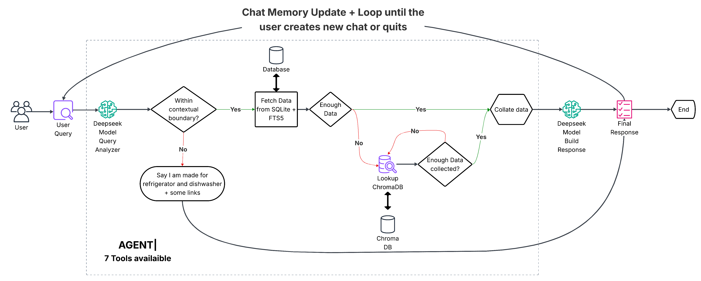

# PartSelect AI Assistant - RAG-Powered Chatbot

## Project Overview

**PartSelect AI Assistant** is an intelligent chatbot powered by Retrieval-Augmented Generation (RAG) that provides real-time assistance for refrigerator and dishwasher parts, repairs, and troubleshooting. The system delivers accurate, up-to-date information with actual PartSelect product data, pricing, and repair guides.

### Key Features

- **Real-time Parts Search** with actual prices and availability
- **Troubleshooting Guides** with repair video links
- **Model Compatibility Checking** for accurate part matching
- **Educational Content** for maintenance and installation
- **Smart Query Routing** based on user intent
- **Cost-Efficient AI** with optimized RAG architecture

### Advanced Features

- **Context-Aware Responses** based on query type and intent
- **Smart Fallbacks** when primary data insufficient
- **Conversation Memory** with thread-based conversation management
- **Real URL Integration** to PartSelect product pages
- **Response Regeneration** for improved answer quality
- **Conversation Statistics** and management tools
- **Multi-turn Conversations** with context preservation

## User Interface


*Modern, user-friendly interface featuring categorized question suggestions, real-time chat capabilities, and quick access to customer service features*

The interface includes:
- **Smart Question Categories**: Part Search, Compatibility Check, and Troubleshooting
- **Real-time Chat**: Interactive conversation with the AI assistant
- **Quick Links**: Easy access to order tracking, returns, shipping, and warranty information
- **Responsive Design**: Clean, modern UI optimized for both desktop and mobile use

## System Architecture

### Architecture Diagram



*Complete system architecture showing the optimized RAG flow from user query to response generation*

### Detailed Architecture

The system uses a **dual-database approach** with **2 LLM calls** for optimal performance:

1. **Query Analysis (LLM Call 1)**: DeepSeek API analyzes user intent and extracts key terms
2. **Primary Data Fetch**: Fast SQLite + FTS5 queries for exact matches
3. **Vector Enhancement**: ChromaDB semantic search when additional context needed
4. **Response Generation (LLM Call 2)**: Single LLM call with complete context

**Core Component**: `RAGOrchestrator` - Main orchestrator that manages the entire RAG process

### Agent Tools

The AI assistant has access to **7 specialized tools** for comprehensive assistance:

1. **`search_parts`** - Search for appliance parts with filters (brand, category, price, stock)
2. **`get_part_details`** - Get detailed part information by part number (PRIMARY tool for specific parts)
3. **`search_compatible_parts`** - Find parts compatible with appliance models
4. **`search_repair_guides`** - Search troubleshooting and repair guides by symptom
5. **`search_blog_content`** - Search educational blog articles and maintenance tips
6. **`get_available_brands`** - Get list of available brands in the database
7. **`get_price_range`** - Get price ranges for part categories

### Database Architecture

- **Primary Database**: SQLite + FTS5 for fast, structured queries
- **Vector Database**: ChromaDB with Voyage AI embeddings for semantic search
- **Data Sources**: 13,584+ parts, 21+ repair guides, 219+ blog articles

## Project Structure

```
Instalily-PartSelect/
├── backend/           # FastAPI backend with RAG agents
├── frontend/          # React frontend application
├── scraping/          # Web scraping tools for data collection
├── requirements.txt   # Main project dependencies
└── README.md         # This file
```

## Prerequisites

- **Python 3.8+**
- **Node.js 16+**
- **SQLite 3.0+**
- **API Keys**: DeepSeek API, Voyage AI API
- **pip** (Python package manager)
- **npm** or **yarn** (Node.js package manager)

## Installation & Setup

### 1. Clone and Setup

```bash
# Clone the repository
git clone https://github.com/anuj3509/Instalily-PartSelect.git
cd Instalily-PartSelect

# Create virtual environment
python -m venv venv
source venv/bin/activate  # On Windows: venv\Scripts\activate
```

### 2. Install Dependencies

```bash
# Install all Python dependencies
pip install -r requirements.txt

# Install frontend dependencies
cd frontend
npm install
cd ..
```

### 3. Environment Configuration

```bash
# Copy environment template (if available)
cp .env.example .env

# Edit .env file with your API keys
DEEPSEEK_API_KEY=your_deepseek_api_key
VOYAGE_API_KEY=your_voyage_ai_api_key
OPENAI_API_KEY=your_openai_key_here
```

### 4. Database Setup

```bash
cd backend

# Initialize database with schema
python -c "from database.database_manager import PartSelectDatabase; db = PartSelectDatabase(); print('Database initialized')"

# Load sample data (if available)
python -c "from database.database_manager import PartSelectDatabase; db = PartSelectDatabase(); db.load_data_from_json()"
```

### 5. Vector Database Setup

```bash
cd backend

# Setup ChromaDB collections
python -c "from services.vector_store.setup import PartSelectVectorStore; vs = PartSelectVectorStore(); vs.setup_collections()"

# Ingest data into vector store
python services/vector_store/setup.py
```

## Running the Application

### Backend Server

```bash
cd backend

# Start FastAPI server
python rag_main.py

# Server will start on http://127.0.0.1:8080
# API documentation available at http://127.0.0.1:8080/docs
```

### Frontend Application

```bash
cd frontend

# Start React development server
npm start

# Frontend will open on http://localhost:3000
```

